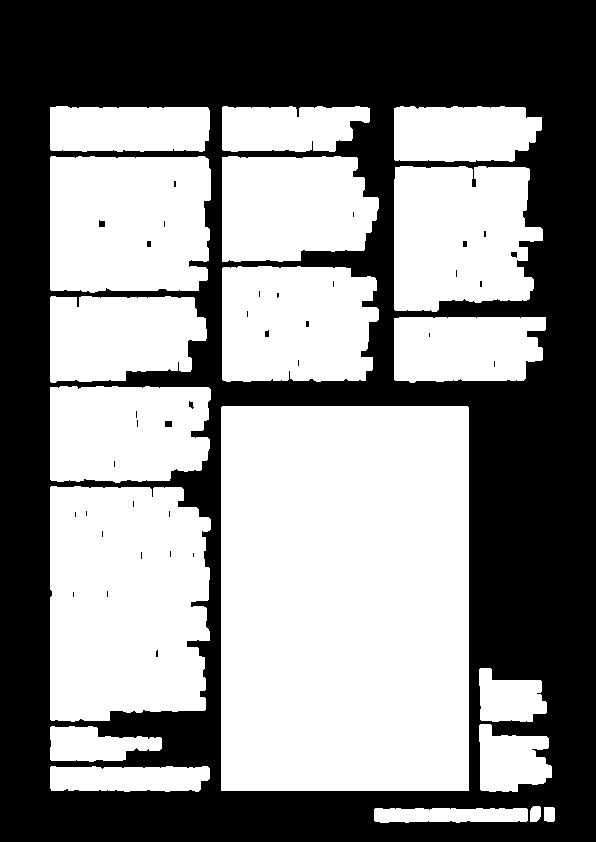
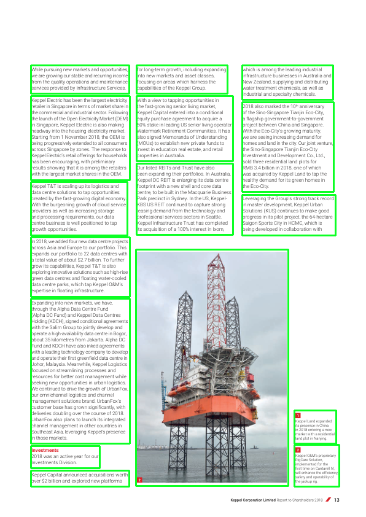

# PDF-Text-Extraction-and-Ordering-with-OpenCV
Automated Text Extraction and Structuring from PDF Documents

## Introduction
This repository contains code for extracting text from PDF documents in an ordered manner. The process involves detecting paragrap contours using OpenCV and then using PyMuPDF to extract the text. Finally, the extracted text is saved to an Excel sheet using the XlsxWriter library.

## Installation
To install the necessary dependencies, run the following commands:

```bash
pip install --upgrade pymupdf
pip install opencv-python
pip install xlsxwriter
```

## Preprocessed Image


## Result



